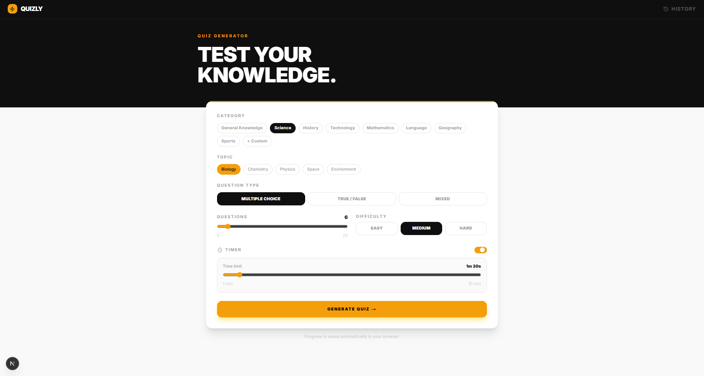
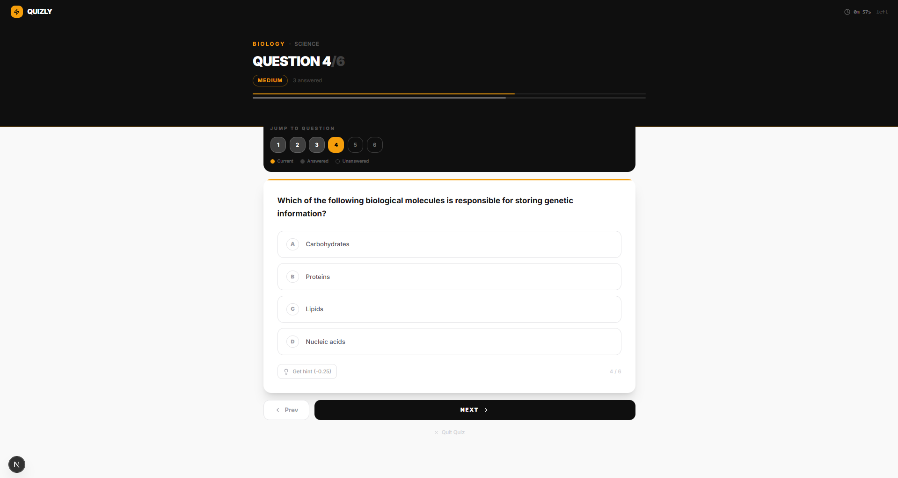
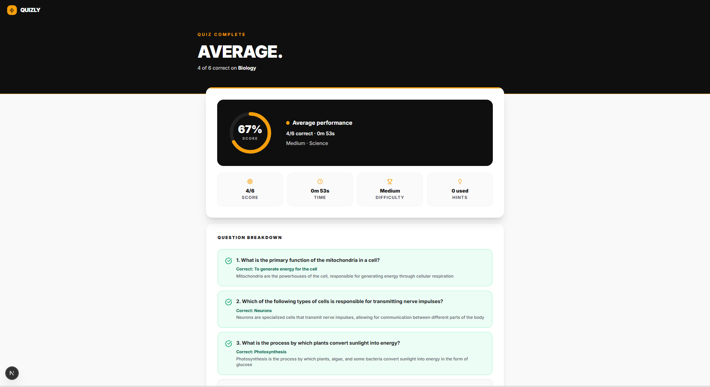

# Quizly — AI Quiz App

A quiz app that generates questions on any topic using AI. Built with Next.js 14, Tailwind CSS, and TypeScript.

---

## Setup

1. Clone the repo and install dependencies

```bash
git clone https://github.com/your-username/ai-quiz-app.git
cd ai-quiz-app
npm install
```

2. Create a `.env.local` file in the root and add your Groq API key

```env
GROQ_API_KEY=your_api_key_here
```

You can get a free key at [console.groq.com](https://console.groq.com)

3. Start the dev server

```bash
npm run dev
```

App runs at `http://localhost:3000`

---

## AI Integration

Uses the **Groq API** with the `llama-3.3-70b-versatile` model.

The API key stays on the server - all AI calls go through Next.js API routes:

- `/api/generate-quiz` - takes topic, difficulty, question count, and type → returns questions as JSON
- `/api/get-hint` - takes a question and its options → returns a subtle hint without giving away the answer

Both routes retry up to 3 times with exponential backoff (1s, 2s, 4s) if the API rate limits or fails.

---

## Architecture

**Framework:** Next.js 14 App Router - one route per page (`/`, `/quiz`, `/results`, `/history`)

**State:** React Context API (`QuizContext`) - holds the active quiz, current question index, answers, timer, hints used, and full quiz history. Chose Context over Zustand/Redux since the state shape is simple and doesn't need middleware.

**Storage:** Everything is saved to `localStorage` - quiz history and in-progress quiz state. This means progress survives page refreshes. No backend or database needed.

**Types:** Strict TypeScript throughout - `Question`, `Quiz`, `QuizAttempt`, `UserAnswer`, and `QuizSettings` interfaces defined in `src/types/index.ts`.

---

## Features

- Generate quizzes on any topic with custom difficulty and question count
- 8 preset categories (Science, History, Tech, etc.) plus a fully custom option
- Multiple choice, True/False, or a mix of both
- Optional countdown timer per quiz
- Hints during the quiz (costs -0.25 points each)
- Question navigation map - jump to any question directly
- Progress auto-saves to localStorage on every answer
- Results page with an animated score ring and full question breakdown
- Quiz history with filtering by difficulty and category, sorting, and retake support
- Performance analytics - score trend over time, avg score by difficulty, category breakdown, and daily streak

---

## Screenshots

| Home | Quiz | Results | History |
|------|------|---------|---------|
|  |  |  |  |

---

## Known Limitations

- History is stored in the browser only — no cross-device sync
- Groq's free tier has rate limits; heavy usage may hit them temporarily
- No offline support — question generation needs an internet connection
- LocalStorage can hold roughly 500+ attempts before hitting size limits
